# 基于 LaMa 模型的图片去水印技术原理

## 项目概述

本项目是一个基于 **LaMa (Large Mask Inpainting)** 深度学习模型的图片去水印工具。通过前端交互式框选水印区域，后端使用 LaMa 模型进行高质量图像修复，实现精准去除固定位置水印的效果。

## 技术架构

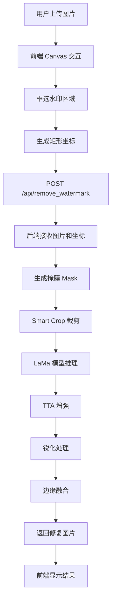

## 核心算法流程

### 1. 掩膜生成

用户在前端通过拖拽框选多个矩形区域，后端根据这些坐标生成二值掩膜：

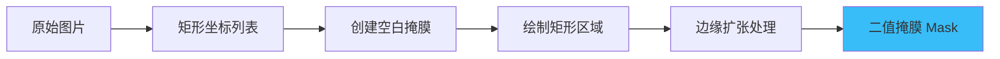

**关键代码逻辑**：
- 将用户框选的矩形坐标转换为二值掩膜（0 为保留区域，255 为需要修复区域）
- 对掩膜边缘进行轻微扩张（默认 6 像素），避免框选过紧导致边缘残留

### 2. Smart Crop 策略

为了提高处理效率，只对包含掩膜的区域进行裁剪和修复：

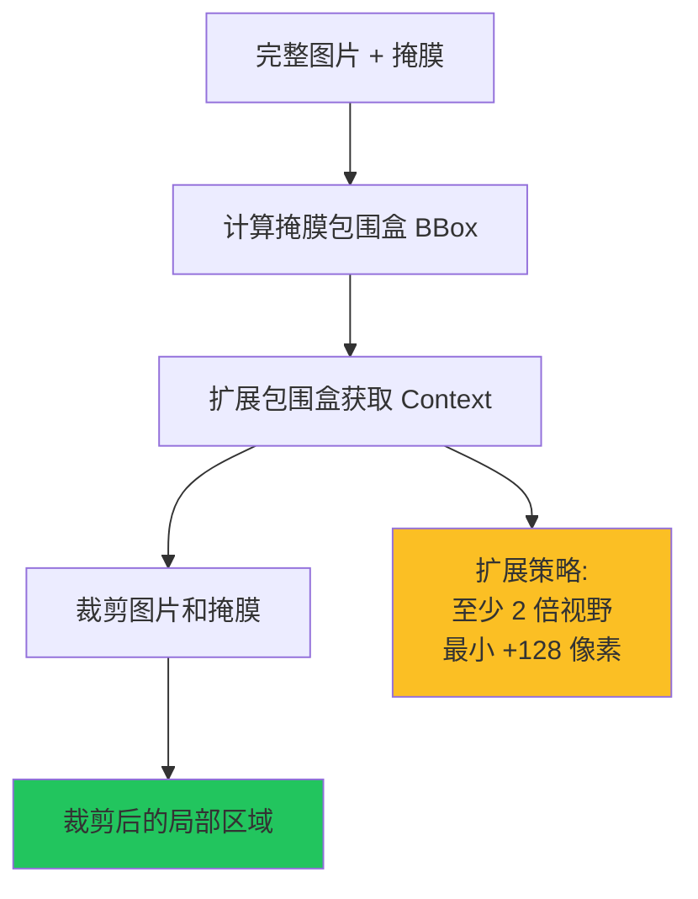

**扩展策略**：
- 计算掩膜的最小包围盒（Bounding Box）
- 以包围盒中心为基准，扩展至至少 2 倍大小
- 保证最小扩展 128 像素，确保模型有足够的上下文信息进行推理

### 3. LaMa 模型推理

LaMa (Large Mask Inpainting) 是基于 **Fast Fourier Convolutions (FFC)** 的图像修复模型：

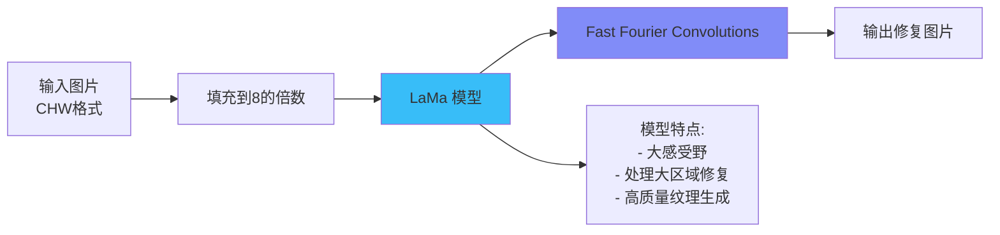

**LaMa 模型核心**：
- **Fast Fourier Convolutions (FFC)**：在频域和空域同时进行卷积，能够捕获全局和局部特征
- **大感受野**：能够理解更大范围的图像上下文，适合修复大面积区域
- **ResNet 架构**：使用残差连接，保证训练稳定性和修复质量

### 4. Test Time Augmentation (TTA)

通过数据增强提升修复质量：

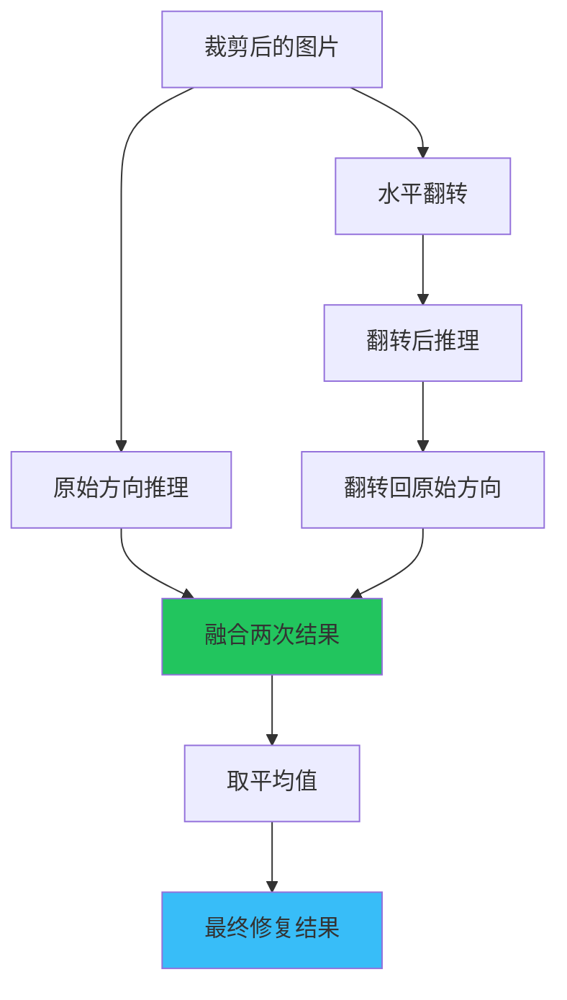

**TTA 优势**：
- 从不同角度"观察"图片，互补盲区
- 通过平均融合消除随机伪影
- 提升修复结果的平滑度和一致性

### 5. 后处理优化

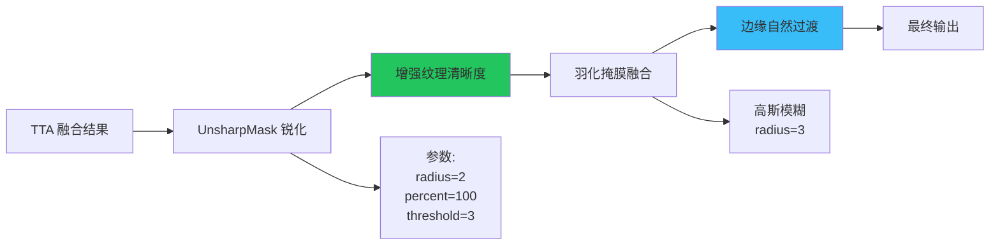

**后处理步骤**：
1. **锐化处理**：使用 UnsharpMask 滤镜增强修复区域的纹理，使其更接近原图质感
2. **边缘融合**：使用高斯模糊的掩膜进行羽化，实现修复区域与原始区域的平滑过渡

## 系统架构详解

### 前端交互流程

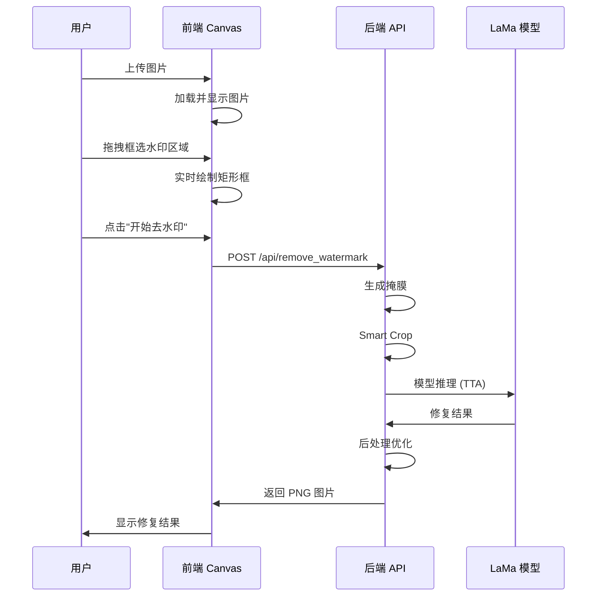

### 后端处理流程

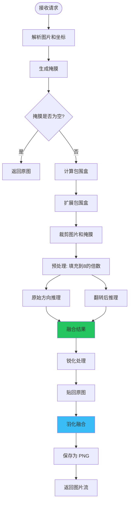

## LaMa 模型原理

### Fast Fourier Convolutions (FFC)

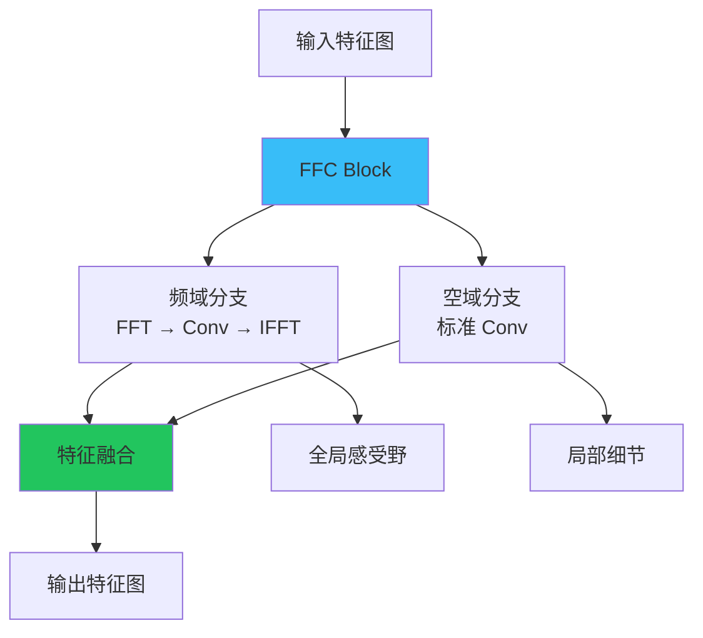

**FFC 核心思想**：
- **频域分支**：通过 FFT 转换到频域，卷积后再 IFFT 转回空域，捕获全局信息
- **空域分支**：标准卷积操作，保留局部细节
- **双分支融合**：结合全局上下文和局部细节，实现高质量修复

### 模型架构

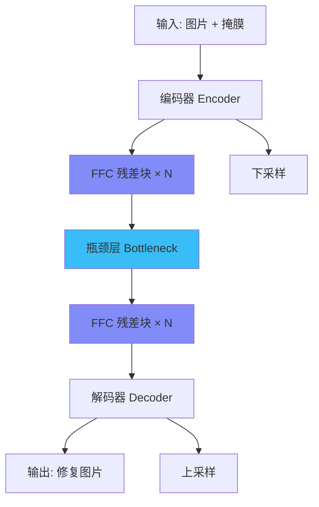

## 性能优化策略

### 1. Smart Crop 优化

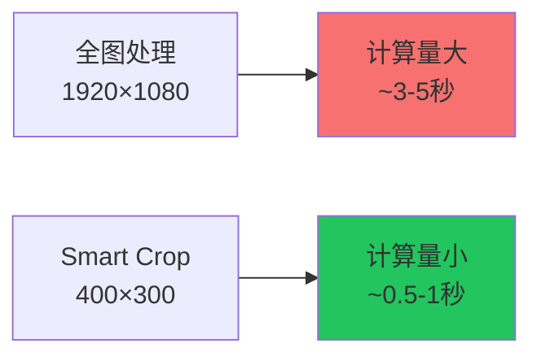

**优势**：
- 只处理需要修复的区域，大幅减少计算量
- 保持足够的上下文信息，不影响修复质量
- 处理速度提升 3-5 倍

### 2. 模型加载优化

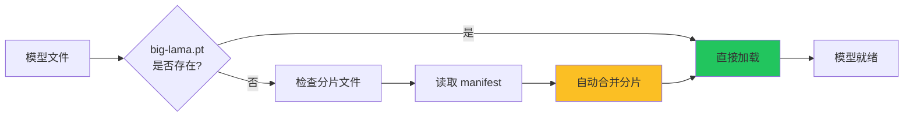

## 技术特点总结

### 优势

1. **高质量修复**：LaMa 模型基于 FFC，能够生成高质量的纹理和细节
2. **大区域处理**：支持修复大面积水印区域，不会出现模糊或伪影
3. **交互友好**：前端支持多区域框选、撤销重做、缩放查看等功能
4. **性能优化**：Smart Crop 策略大幅提升处理速度
5. **边缘自然**：羽化融合技术保证修复边缘过渡平滑

### 适用场景

- ✅ 固定位置水印去除
- ✅ 字幕去除
- ✅ 物体移除
- ✅ 图像修复

### 局限性

- ❌ 不适合动态水印（位置不固定）
- ❌ 需要手动框选区域
- ❌ 对复杂背景的修复效果可能有限

## 未来改进方向

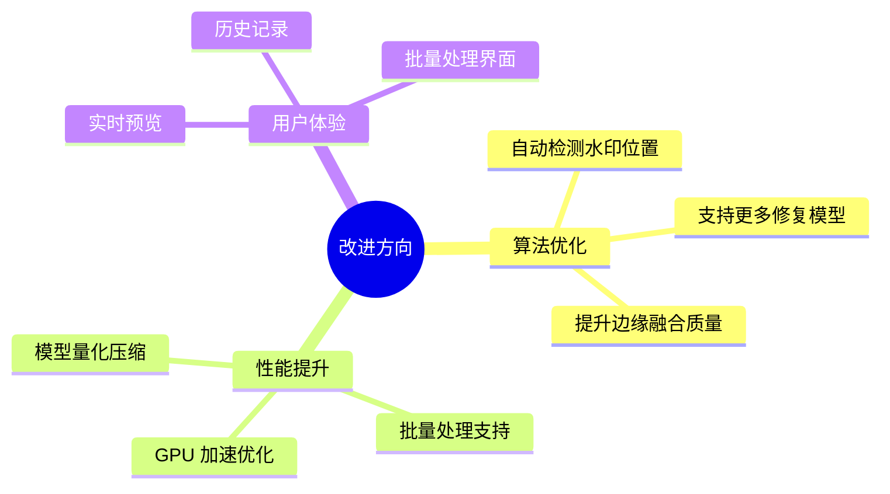

## 总结

本项目通过结合 LaMa 深度学习模型和多种优化策略，实现了高质量的图片去水印功能。核心创新点包括：

1. **Smart Crop 策略**：只处理需要修复的区域，提升效率
2. **TTA 增强**：通过数据增强提升修复质量
3. **边缘融合**：使用羽化技术保证自然过渡
4. **交互优化**：前端提供流畅的用户体验

这些技术的结合，使得该工具在保持高质量修复效果的同时，也具备了良好的实用性和性能表现。

